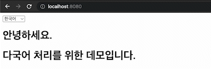

# Spring 기반 다국어 처리 데모

---

HTTP Session 에 정의된 Locale의 값에 따른 메시지 노출 데이터를 유동적으로 변경 가능합니다.

한국어 / 영어 / 일본어로 이루어진 텍스트를 각각 messages_[locale code].properties의 파일로 생성합니다.

`ResourceBundleMessageSource` 의 클래스로 resources/language/ *.properties를 읽어와 Bean에 등록하며,

`SessionLocaleResolver`의 Locale에 따라

- KOREA : messages_ko.properties
- ENGLISH : messages_en.properties
- JAPAN : messages_ja.properties

의 데이터를 load 시킵니다.

`LocaleChangeInterceptor` 의 인터셉터를 등록시켜 `language` 라는 parameter에 따라 `SessionLocaleResolver` 의 Locale 값을 변경합니다.

propertis 파일에는 동일한 Key 값으로 Value를 맵핑 시켜주고, Thymeleaf 의 구문을 이용하여 해당 Key 값에 맞는 Value를 노출시킵니다.

